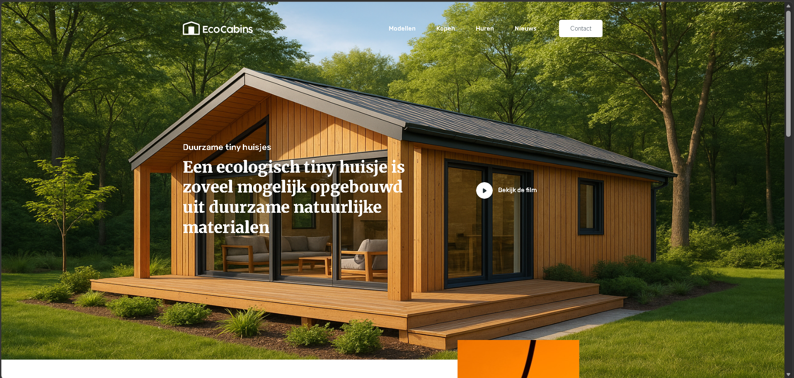
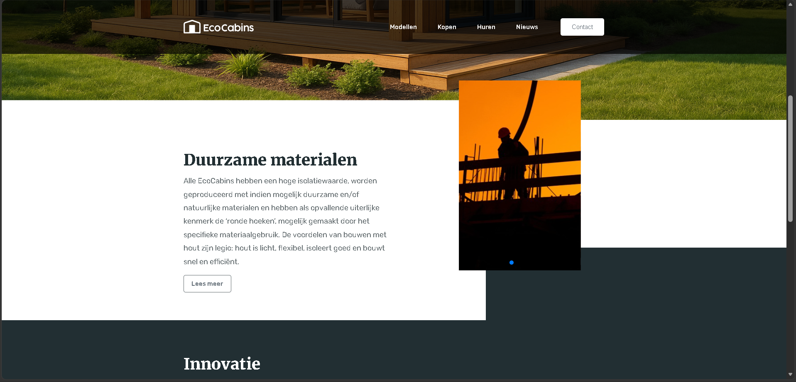
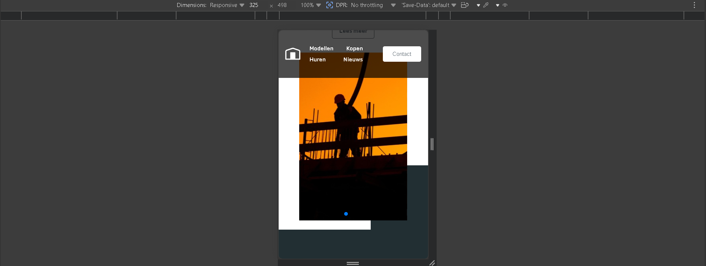

# 🌿 EcoCabins — Landing Page

Responsive landing page for an eco-friendly cabin rental service. Designed with a clean layout, modern UI, and smooth user experience across all devices.

🔗 **Live Demo:** https://pavlolab.github.io/eco-cabins/

---

## 🖼️ Preview

---

## 🚀 Features

- Fully responsive design (mobile → desktop)
- Clean and modern eco-style UI
- Hero section with background image
- Informational sections with structured layout
- Slider component for visual presentation
- Smooth scrolling and basic interactivity
- Well-organized and maintainable code

---

## 💼 What I Can Do For You

- Convert Figma design into responsive website  
- Build modern landing pages with clean UI  
- Create responsive layouts for all devices  
- Add sliders, sections, and interactive elements  
- Fix layout and styling issues  

---

## 🛠️ Tech Stack

- HTML5  
- SCSS / CSS3  
- Flexbox & CSS Grid  
- JavaScript  
- Swiper.js  

---

## 📌 About This Project

This project demonstrates my ability to build responsive and visually appealing websites with structured layout, reusable components, and attention to UI/UX details.

---

## 📩 Contact

- GitHub: https://github.com/pavlolab  
- Email: pavlolab.studio@gmail.com